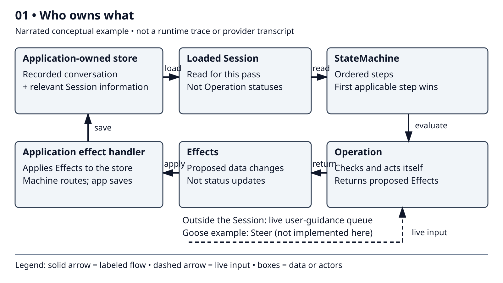
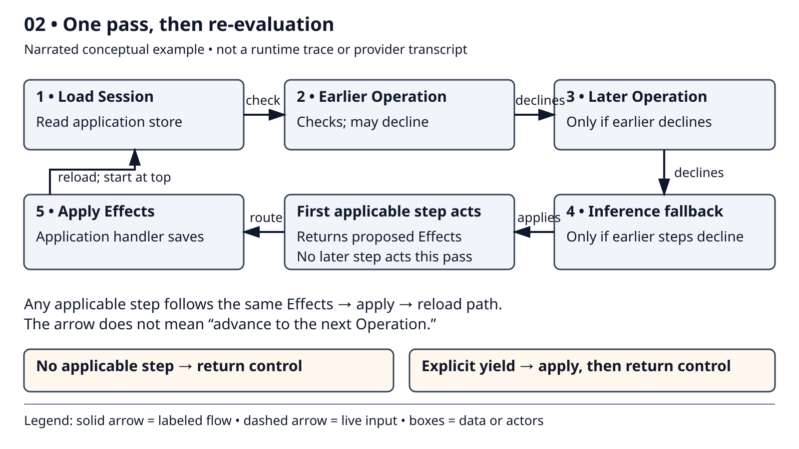
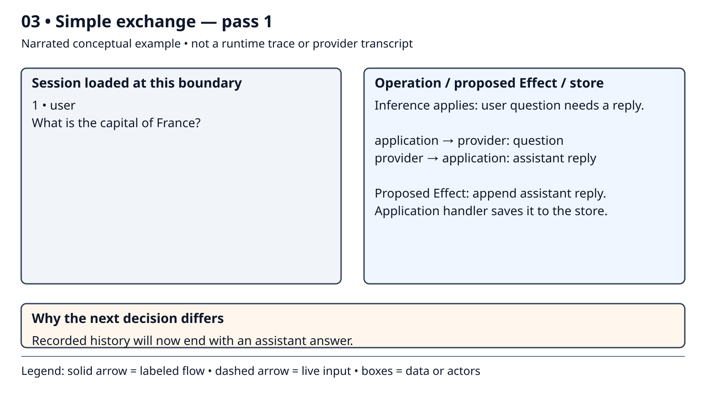
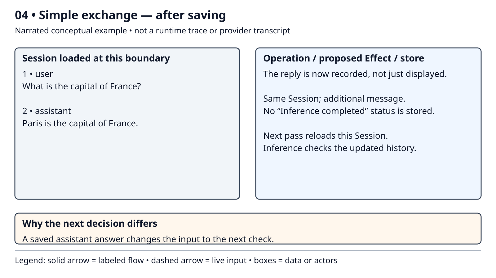
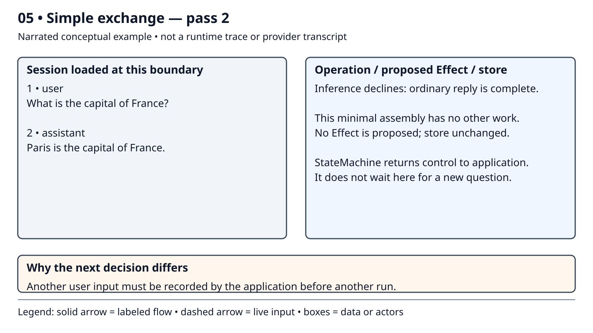

# Lesson 7: GDK State-Machine Mental Model

## Goal

Explain one question/answer round trip through the state machine: where the conversation lives, how a reply is saved, and why the machine stops.

This is a **no-code lesson**. No provider or Cargo run is needed. Tools return in Lesson 9.

## Prerequisites

Complete Lessons 1–6. Recall that the application owns conversation history and sends it to the provider when asking for a response.

## 7.1 — From a fixed sequence to a decision

So far, our application has decided each action in advance. The state machine instead asks: **what work is needed now?**

Today we use one question: “What is the capital of France?” The machine asks the provider, records the answer, checks again, and returns control to the application.

## 7.2 — Five ideas

- **Session:** the recorded conversation and relevant session information. The application owns the **store** where it is saved.
- **Operation:** a rule that checks whether it has work. It either declines or acts. It can read the Session and other available inputs.
- **Effect:** a proposed change to recorded data—for example, adding the assistant's reply. The application's **effect handler** applies that change to the store.
- **StateMachine:** checks an ordered list of steps. The first applicable step acts. Its Effects are applied before checking starts again from the top.
- **Re-evaluation:** reload the Session and decide again. A saved answer changes what work is needed; there is no list of Operation completion statuses.

**Inference** means asking the provider/model for a response. It is the only step in today's example. When we later add other Operations, inference will be our final fallback.

### Visual 1 — Who owns what

**Read the diagram:** store → loaded Session → Operation → Effects → effect handler → store. The machine coordinates; the application saves.

The dashed path is a reminder that a Session need not contain every input. For example, Goose's **Steer** Operation can also read a live queue of user guidance. We do not implement it here.

**Legend:** solid arrows show the labeled flow; dashed arrows show live input. Color is not needed to follow the diagrams.

## 7.3 — Three layers: vocabulary, engine, and application

The GDK separates shared data, the rules for coordinating work, and a particular application's choices:

| Layer | Purpose | In this course |
|---|---|---|
| **Types — shared vocabulary** | Defines messages and conversation data | The data our application and the engine exchange |
| **Protocol — reusable engine** | Defines how Operations, Effects, and the StateMachine work together | Coordinates checking, acting, saving, and re-evaluation |
| **Assembly — a particular application** | Chooses the Session, store, Effects, and ordered steps | Our small application, rather than Goose's full agent |

**Goose is one application assembled from the GDK. We are building another, using the same engine but choosing our own storage and steps.** That is why Lesson 8 supplies a Session and effect handler rather than receiving a complete application from the library.

## 7.4 — One run can contain several passes

A **user turn** begins with a new user question. A **run** is the application's call to the machine. A **pass** is one check through the steps during that run.

Each pass loads the Session and checks steps in order. The first applicable step acts and returns Effects. After the handler saves them, the next pass starts from the top—not from the following step.

### Visual 2 — Check, save, check again

**Read the diagram:** a decline allows the next step to check. An applicable step ends the scan. Apply its Effects, then reload and check again.

If no step applies, the run ends. A step can also request an **explicit yield**: apply its Effects, then return control. Today's example ends because no step applies. Errors, cancellation, and execution limits are implementation concerns for Lesson 8.

**Predict:** if two steps could act, which wins? Where does the next pass start?

## 7.5 — One question/answer round trip

The application has already saved the question in a Session. Our only step is inference. Assume a normal text answer; the example wording is illustrative, not observed model output. The snapshots show recorded conversation fields, not exact provider requests.

### Visual 3 — Ask and propose a reply

**Pass 1:** inference applies because the user question needs a reply. The exchange is **application → provider**, then **provider → application**. Inference returns an Effect proposing that the assistant reply be added to the conversation. The handler saves it.

**Predict:** what must be recorded before the next pass can recognize that the question has been answered?

### Visual 4 — The answer is saved

The same Session now contains both messages. We added an answer, not an “Inference completed” flag. The next pass reloads this updated conversation.

### Visual 5 — Check again and stop

**Pass 2:** the conversation ends with an ordinary assistant answer, so inference declines. No other step exists in this example. There are no Effects to apply, and the run returns control to the application.

**One user turn, one run, one provider round trip, two passes:** one acts; the other finds no work. The finished run does not wait for another question. The application must record new input and start another run.

## Checkpoint

Use the frames to explain:

1. Where does the conversation live?
2. Which step acts on pass 1, and what Effect does it propose?
3. Who saves the reply?
4. Why does pass 2 stop instead of asking the provider again?
5. If several steps could act, which gets first say?

**Success:** you can narrate “load → check → act → save → reload → no work” and distinguish the Operation's work from its proposed Effect.

An in-memory store can retain the Session across passes and runs in the same process, but not across process exit. It does not guarantee identical future decisions when live inputs change.

## Next and references

Lesson 8 supplies the complete running version of this exchange, showing streamed output and the saved Session. Lesson 9 adds successive user turns and the planned-loss tool round trip.

This lesson follows the [README](../../README.md#replacement-state-machine-lesson-plan) and [Working Mental Model](../../reference-material/Goose%20GDK%20State%20Machine%20%E2%80%94%20Working%20Mental%20Model.md). Engine behavior was checked against `goose-agent` **0.1.0-alpha.11**: `src/machine.rs`, `src/operation.rs`, and `src/inference.rs`. See the [instructor notes](../../instructor-notes/07-state-machine-mental-model.md) for source-review details and the [diagram guide](diagrams/README.md) for editable assets.
