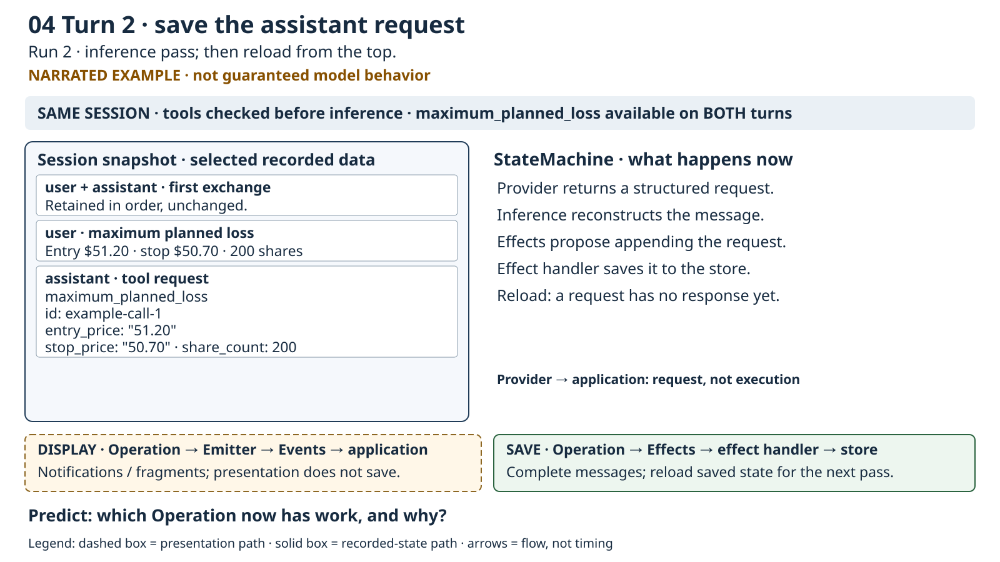
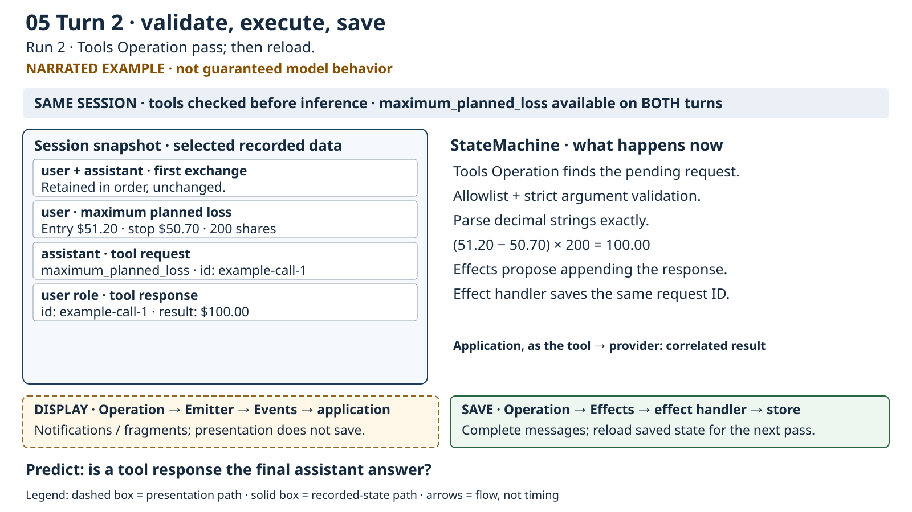

# Lesson 9 — One Session, successive user turns, and selective tool use

## Goal

Continue a conversation through two machine runs, with the same calculator available throughout. Observe when the model requests it, how the application validates and executes it, and why saving a correlated result creates work for inference again.

**Status:** implemented; default live scenario validated, live 100-share tweak and instructor review pending. The endpoint was unavailable during initial implementation, then became available for output-order verification. The narrated trace below is not an observed model transcript.

## Concepts introduced

- A **user turn** begins when the application saves a new human input. A **machine run** handles that input until control returns. A **pass** checks the ordered steps against freshly loaded state; several passes may belong to one run.
- **Tool selection** is the model's choice to request an advertised capability. Availability does not imply necessity. The application—not the model—controls which capabilities can execute.
- A **pending request** is recorded tool-request content without a matching response in the current user turn.
- A **correlation ID** connects a tool request to its response. It is not an Operation status or the enclosing message's ID.
- The **tool execution boundary** is inside our application: untrusted names and arguments must pass allowlisting and validation before deterministic arithmetic.
- A **run safeguard** bounds work or elapsed time. It prevents continuing indefinitely; it does not make model selections correct.

Reuse Session, Operation, StateMachine, Effect, re-evaluation, Events, and Emitter from Lessons 7–8. An Event supports display; an Effect proposes a saved-state change.

## Prerequisites and complete supplied code

Complete Lessons 1–8, including the raw calculator round trip in Lessons 5–6. Have a reachable streaming/tool-capable provider, a valid provider JSON, and the pinned Rust toolchain. No new dependencies or provider-schema changes are required.

The entire [reference source](src/main.rs) is supplied, including runtime traits, validation, concurrency, and safeguards. These are not fill-ins. Lesson directories share the root manifest; they are not independent Cargo applications. Root `src/main.rs` contains this implementation. If restoring it after a tweak, save your own edits first:

```bash
cp lessons/09-machine-conversation-tools/src/main.rs src/main.rs
cargo run -- custom_aa_llama_qwen3_6-35b.json
```

Use your own JSON path when appropriate. `.env` is loaded before provider construction; the first JSON-declared model is selected. Named model selection and interactive input remain later work.

## 9.1 — Predict both turns, then run

The first input is **“What is stop-loss referring to in day trading?”** Predict a conceptual explanation with **no calculator request**: there are no numeric inputs to calculate.

The follow-up asks for maximum planned loss for a hypothetical long position: entry `$51.20`, stop `$50.70`, `200` shares. Predict the structured calculation request and `(51.20 − 50.70) × 200 = $100.00`. This excludes fees, slippage, and gaps through the stop. Maximum planned loss is not expected statistical loss or a guaranteed ceiling on realized loss.

Run the command above. Check actual saved content, not just prose claiming a calculation occurred. The tool remains available on turn 1. We neither force a tool request nor remove the capability to manufacture the desired pattern.

An unexpected first-turn request or missing second-turn request is a provider/model outcome, not successful validation. The application reports it. Invalid arguments receive errors, never invented values. An inference diagnostic, timeout, or safeguard also prevents declaring success.

## 9.2 — Explain continuity between runs

The **store** is the application-owned in-memory record. It lasts across these two runs in one process, not across process exit. After run 1 returns, the application appends the second human input to the same Session. This preserves the earlier exchange; it resets only the per-run counter and halt reason.

A **share count** is the positive whole-number quantity used in the hypothetical trade. One supplied constant drives the follow-up and its structural check:

```rust
const SHARE_COUNT: u32 = 200;
```

The application formats the follow-up using that value and then starts another run:

```rust
runtime.append_user(&follow_up).await?;
let second_ok = run_turn(&machine, &runtime, &cancel, 2).await?;
```

A finished run does not wait for new input itself. The application owns that boundary. The tool request/result/final-answer sequence happens *inside* run 2, not as three human turns.

## 9.3 — Assemble tool work before inference

A **tool provider** supplies advertised definitions and their application implementations to the GDK tool operation. Here it offers only the existing calculator, backed by the typed `LossArguments` shape and Lesson 6 validation. This uses the SDK's provider interface rather than introducing the RMCP typed-tool traits or a new serialization format.

An **adapter** connects that SDK operation to our additional safety rules. `SafeTools` returns correlated errors for unknown/excess requests, then delegates remaining requests to the shipped operation after re-evaluation. Its name is `tools`; the SDK inference runner's name is `llm`, not a provider or model identifier.

```rust
let tools = SafeTools {
    inner: ToolOperation::new().with_provider(Arc::new(LossToolProvider)),
};
let steps: Vec<Step<'_, ChatSession, ChatEffect>> = vec![
    Step::Operation(Arc::new(RunLimit)),
    Step::Operation(Arc::new(tools)),
    Step::Inference(Arc::new(runner)),
];
```

Before inference, Operations can also shape what the provider sees. The adapter contributes the calculator through `inference_tools` and the educational instruction through `prompt_parts`. The default inference preparer joins those prompt parts into the system instruction. This familiar educational guidance permits concepts directly and calculations when appropriate; the fuller assistant contract belongs to Lesson 10.

These changes are more than a new step list: the runtime gains append/reset handling and a saved pass count/halt reason; the Effect type gains a halt record; presentation recognizes tool-response Events; observation inspects both turns and correlation.

## 9.4 — Validate, execute, correlate, re-evaluate

The **argument shape** specifies decimal-string entry/stop prices and an integer share count. Deserialization rejects missing, wrongly typed, and unknown fields. Prices are parsed immediately into exact decimal values—not binary floating point—and must be positive plain decimal strings with at most four fractional places. Shares must be positive and fit the supplied whole-number type; entry must exceed stop. Checked arithmetic rejects values whose result exceeds the decimal representation. Dollar output uses two places.

```rust
#[derive(Deserialize)]
#[serde(deny_unknown_fields)]
struct LossArguments {
    entry_price: String,
    stop_price: String,
    share_count: u32,
}
```

The advertised schema guides the model; it does not enforce these rules. Only the allowlisted `maximum_planned_loss` name reaches execution.

Every content block across the current turn is examined, including multiple requests and interleaved text. The adapter answers unknown names and excess calls with errors. The SDK operation returns parse errors and validates/executes recognized calls through our provider. Responses retain request IDs and provider metadata. A user-role message containing tool-response content has effective provider role **tool**; it is not another human question.

The successful trace is:

| Reloaded state | Work that applies | Proposed saved change |
|---|---|---|
| Numeric human input | Inference | Assistant request, e.g. ID `example-call-1` |
| Unanswered request | Tools | User-role response, same ID, `$100.00` |
| Correlated tool result | Inference | Educational assistant explanation |
| Ordinary final answer | No applicable step | Run returns |

The machine reloads and checks from the top each time. No Operation-completion flag is changed. Additional requests can change this trace, and unknown-call error handling can add a pass.

### Narrated lecture frames

Use [six editable/rendered frames and their captions](diagrams/README.md) in order. Their snapshots show selected recorded data for readability, not exact provider requests or full runtime dumps. The correlation ID is illustrative; model wording and message counts may differ.



**Caption:** the assistant request is saved through Effects. Its name, decimal-string arguments, and ID justify inspection, not unconditional execution. Predict which Operation applies after reload.



**Caption:** the application's tool boundary validates and calculates, then proposes a response with the same ID. Predict why inference now applies again. See the diagram guide for every frame's text equivalent and reveal question.

## 9.5 — Separate presentation from recorded state

The **payload delimiter** is the identical `++++++++` line before and after displayed protocol values; commentary is outside it. Lesson 9 reuses the Lessons 5–6 convention. Lesson 8's no-fence exception remains unchanged.

Actor labels distinguish `application → provider`, `provider → application`, and `application, as the tool → provider`. The displayed instruction/tool definition are contributions to inference, not a complete serialized outbound request. Complete Session before/after views show all recorded fields, messages, metadata, usage, pass count, and halt reason. They are snapshots, not payload dumps; they are not fenced.

**Terminal styling** uses ANSI control sequences to distinguish presentation categories without changing stored messages or protocol values. Headings and turn boundaries are bold cyan; the separately displayed human input is blue; reconstructed tool requests are magenta; tool responses and successful checks are green; warnings are yellow; errors are bold red. Streamed model text remains in the terminal's normal color. Only the entire `usage` section of each Session snapshot is dimmed, including its nested fields; conversation history and every other field remain at normal brightness. Every Session attribute name is gold (`#FFD700`), including nested metadata/usage fields and quoted object keys; values and Debug type names are not bold. Usage values remain dim as previously agreed. Labels and payload fences remain readable without color.

Styling is enabled only for terminal output, disabled for `TERM=dumb`, and disabled when `NO_COLOR` is present. Standard output and standard error are checked separately. No new dependency or CLI option is needed. To compare with plain text:

```bash
NO_COLOR=1 cargo run -- custom_aa_llama_qwen3_6-35b.json
```

Redirecting output to a file also produces plain text. The new blue human-input block shows the current turn's question, not a complete serialized provider request. Full Session snapshots still retain all fields and values.

`tokio::join!` polls the Event receiver while `StateMachine::run` executes. Text is flushed as it arrives; tool-response Events display correlated structured content under the tool actor label. Saving still happens through Effects and the handler. After saving a reconstructed assistant request, the handler emits a presentation-only copy through the same Event queue. The receiver prints its complete request blocks before the tool-response Event and the final answer stream. The presentation marker is never stored or sent to the provider; accompanying text is not replayed. Post-run validation no longer reprints the request. Dropping the sole Emitter after success or error closes the channel; the receiver drains before the final Session view. Even failed runs show saved partial state. No whole-run Event buffering replaces live consumption.

Expected structural observation (not exact terminal text):

```text
Turn 1: same Session starts with conceptual question
  live conceptual explanation; saved assistant answer
  Observed turn 1: 0 tool request(s), 0 tool response(s).
Turn 2: first exchange retained, numeric user input appended
  saved request maximum_planned_loss, actual correlation ID
  tool response with same ID, $100.00
  streamed and saved educational explanation
  Observed turn 2: tool request(s) and correlated tool response(s)
```

The automatic checks inspect inputs, deterministic result, response IDs, retained history, some displayed text, and an ordinary saved final answer. They do **not** prove the final generated explanation accurately uses the result or repeats exclusions. Review the live and saved final answer yourself; Event counts are not message or pass counts.

## 9.6 — Explain the safeguards, then tweak

The complete code supplies:

- **Eight applied work passes per user turn.** The handler counts applied Effect batches, not messages or Events. `RunLimit` explicitly yields with a recorded reason before further work once the bound is reached. Its terminal halt batch can make the displayed count nine. Ordinary completion at the bound is allowed.
- **Four aggregate tool requests per user turn**, counting unknown and malformed calls too. Every excess pending request gets a correlated error rather than execution; after responses are saved, exceeding the bound halts instead of inferring indefinitely. A prior pass cap or timeout can leave unanswered requests in partial state; these are shown, not called success.
- **180 seconds per run**, covering stalled inference as well as a runaway loop. The timeout drops the run future, cancels the token, closes the sender, and reports failure. This is not rollback or a guarantee about a remote server stopping.
- **Empty or duplicate correlation IDs halt** because responses cannot be safely matched. Externally executed requests follow the pinned SDK's non-dispatch rule; this application provides no external execution mechanism.

These are application decisions, not built-in GDK guarantees. The engine still owns the loop through `StateMachine::run`; no manual pass loop is restored. Supplied safeguards are not deliberate failure-path exercises.

**Approved tweak:** change only `SHARE_COUNT` from `200` to `100` in root source. Predict `$50.00`, run again, then check selected arguments, exact result, matching IDs, retained first exchange, and final explanation. The validator follows that constant. Restore `200` afterward. Restarting the process seeds a fresh store; continuity is between its two scripted runs.

## Validation and success criteria

Repository checks:

```bash
cargo fmt --check
cargo check
cargo clippy --all-targets
cargo test
cargo run -- custom_aa_llama_qwen3_6-35b.json
```

Success requires the same Session/capability on both turns, no first-turn request, valid second-turn calculator input and exact `$100.00` correlated response, an accurate educational final explanation with exclusions, live display distinct from saving, and bounded termination. Do not assert exact wording, token counts, or a universal message count.

Deterministic tests validate boundaries, exact arithmetic including the `$50.00` tweak, all-block/multiple-request handling, unknown/parse errors, request limits, ambiguous IDs, continuity, Effects, full snapshots, and concurrent drain behavior. They do not establish live model selection. If the provider is unavailable, ask the instructor to start or supply one; do not silently substitute mocks.

## Next conceptual step

Lesson 10 will establish the fuller domain instruction and application-enforced safety contract. This lesson adds no trading, shell, arbitrary-network, market-data, retrieval, or interactive CLI capability.
