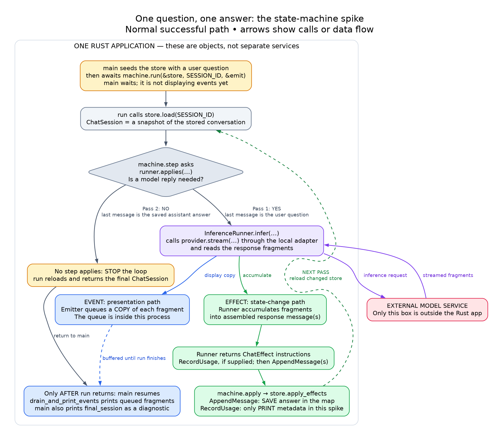
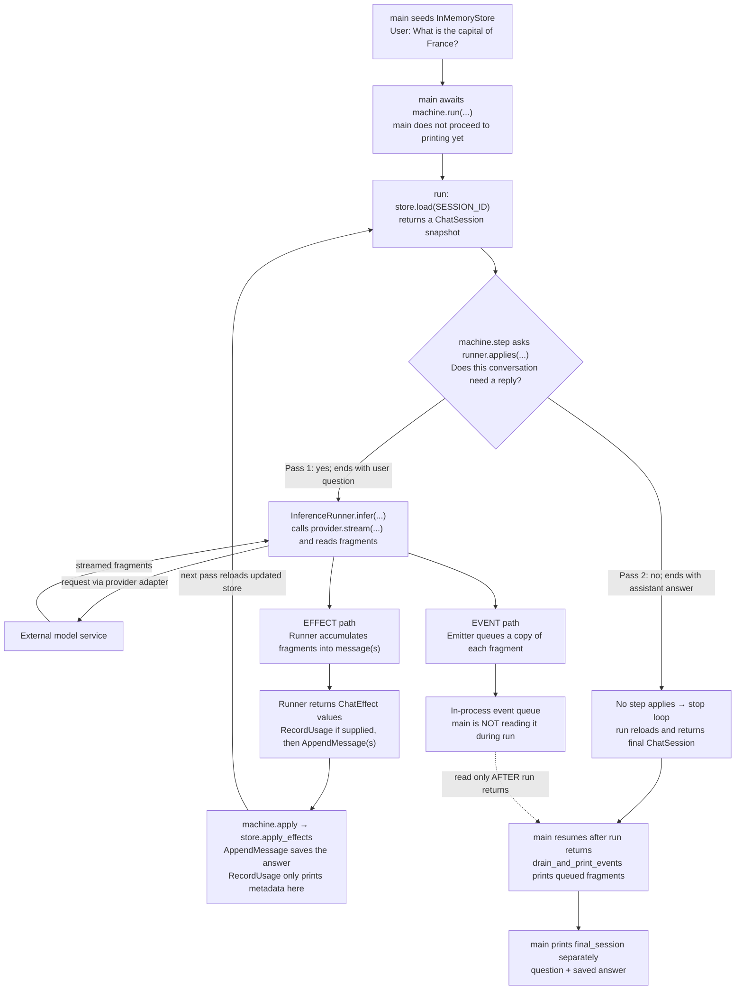

# What the state-machine spike actually does

These diagrams describe the current `src/main.rs` in this spike, **not** the root exercise or a future tool-enabled agent. They show the normal successful question/answer path.

**The main idea:** load the conversation → decide whether it needs a model reply → ask the model → save the reply → load again and reconsider.

This is **one Rust application**. The machine, runner, provider adapter, store, and event queue are objects inside it. Only the model service is outside the application. Creating those objects does not start work; awaiting `machine.run(...)` does.

## 1. Follow the answer's two paths

An **event** is an update for presentation: “here is another response fragment.” An **effect** is an instruction to change application state: “append this assembled message.” The runner produces both, but printing an event does not apply an effect.

A **store** holds the conversation under a session ID. A **session** is a snapshot loaded from that store for one pass. A **pass** is one trip through the machine's registered candidates for work. There is only one candidate in this experiment: the inference runner, which asks the model for a reply.



[Scalable SVG](state-machine-flow.svg) · [Editable Graphviz source](state-machine-flow.dot)

The same structure in editable Mermaid:



### What to notice

- **The runner reads the network stream**, not `main` and not the store.
- **The runner assembles the saved response.** Consecutive fragments sharing a message ID are merged by its conversation accumulator; different IDs remain separate messages.
- **The store's effect handler saves the response**, at `stored.push(message.clone())`. Changing the loaded snapshot alone would not change the store.
- **The display queue does not save the response.** `drain_and_print_events` only extracts and prints text from queued message events.
- **Printing is delayed in this spike.** The model streams, but `main` waits for the whole machine run before displaying the queued fragments. This is buffered playback, not live display.
- **A second pass is not a second model request.** The same inference candidate is reconsidered against newly loaded history and declines once the answer is there.

## 2. The actual order of calls

Read this sequence from top to bottom. All participants except the model service are inside the same Rust application. The provider adapter is the local object that connects the runner to that service.

```mermaid
sequenceDiagram
    participant Main as main / terminal display
    participant Machine as StateMachine
    participant Store as InMemoryStore
    participant Runner as InferenceRunner
    participant Provider as Provider adapter
    participant Model as External model service
    participant Queue as Emitter / event queue

    Main->>Store: Seed conversation with one user question
    Main->>Machine: await run(&store, SESSION_ID, &emit)
    activate Machine
    Note over Main: Waiting for run to finish; not draining events

    rect rgb(235, 245, 255)
        Note over Machine,Runner: PASS 1 — a model reply is needed
        Machine->>Store: load(SESSION_ID)
        Store-->>Machine: ChatSession snapshot: [user question]
        Machine->>Runner: applies(conversation)?
        Runner-->>Machine: true
        Note over Machine,Runner: Only inference is registered: no tools, empty system prompt
        Machine->>Runner: infer(session, conversation, input, emit)
        activate Runner
        Runner->>Provider: stream(model, system prompt, messages, tools)
        Provider->>Model: Send inference request
        loop For each response fragment with content
            Model-->>Provider: Response fragment
            Provider-->>Runner: Message fragment
            Runner->>Queue: emit.message(fragment): queue a display copy
            Note over Runner: accumulator.push(fragment): assemble saved response
        end
        Model-->>Provider: Finish response (usage if reported)
        Provider-->>Runner: End of stream / optional usage metadata
        Runner-->>Machine: Applied result: usage effect if supplied, then message effects
        deactivate Runner
        Machine->>Store: apply_effects(session, effects, emit)
        Note over Store: RecordUsage: print metadata only<br/>AppendMessage: save assembled reply in map
        Store-->>Machine: Effects applied
    end

    rect rgb(240, 250, 240)
        Note over Machine,Runner: PASS 2 — saved reply means no more work
        Machine->>Store: load(SESSION_ID) again
        Store-->>Machine: ChatSession snapshot: [user question, assistant answer]
        Machine->>Runner: applies(conversation)?
        Runner-->>Machine: false
        Note over Machine: No other candidate exists. Stop; no second model request.
    end

    Machine->>Store: load(SESSION_ID) once more for return value
    Store-->>Machine: Final ChatSession snapshot
    Machine-->>Main: Return final_session
    deactivate Machine
    Main->>Queue: drain_and_print_events: read buffered message events
    Queue-->>Main: Response fragments to print consecutively
    Note over Main: Also print final_session conversation as a separate diagnostic
```

Usage metadata can arrive during the stream; its placement above is schematic. On the normal path the runner returns the usage effect, when available, before the accumulated message effects.

## 3. Why it stops: the conversation is the evidence

| Point in the run | Conversation in the store | Decision on this simple successful path |
|---|---|---|
| Before pass 1 | User: “What is the capital of France?” | The user question needs a reply. |
| After pass 1 applies effects | User question, then assistant answer | The answer has been saved. |
| Pass 2 reloads | User question, then assistant answer | The inference runner declines; there is no other candidate. |
| After `run` returns | Same saved conversation | `main` displays the buffered events and the returned snapshot. |

The machine does **not** need a remembered `already_answered` flag. On this path, the persisted reply is enough for the runner to re-derive its decision. The runner's full applicability predicate also checks the initiating user message, trailing errors, and projected content; “ends with user/assistant” is the explanation for this experiment, not its entire general predicate.

“Saved” here means in the in-memory map for the lifetime of this process, **not** on disk. The store disappears when the application exits.

## 4. Find the diagram in the code

| Diagram action | Where to look in this spike's `src/main.rs` |
|---|---|
| Seed starting state | `let store = InMemoryStore::seeded(seed);` |
| Register the single candidate | `vec![Step::Inference(Arc::new(runner))]` |
| Start the whole workflow | `let final_session = machine.run(&store, SESSION_ID, &emit).await?;` |
| Load a snapshot | `impl SessionLoader<ChatSession> for InMemoryStore` |
| Save the assembled answer | `impl EffectHandler<ChatSession, ChatEffect> for InMemoryStore`, especially `stored.push(message.clone());` |
| Describe requested changes | `enum ChatEffect` and its conversion implementations |
| Display buffered fragments | `drain_and_print_events(&mut event_rx);`, **after** `run` returns |

The `run` loop, applicability check, provider call, stream-reading loop, and accumulator are dependency code, not hidden extra code in our application.

### Boundaries of this picture

This is the normal successful path, not a complete error/cancellation diagram. In this pinned release `run` also stops when an applied result yields to the client; it has no built-in maximum-pass bound. The event queue has finite capacity (4096 events here). Since this spike drains it only after `run` returns, a sufficiently long stream could fill it and stall the run. The diagram assumes this short response fits.

## Verification completed

The flow was checked against the current spike source and the **official pinned `0.1.0-alpha.11` crate documentation and source**, rather than inferred from the root lesson:

- [`goose-agent` crate README](https://docs.rs/crate/goose-agent/0.1.0-alpha.11/source/README.md): ordered candidates, effects, session loading, and the run loop's purpose.
- [`machine.rs`](https://docs.rs/crate/goose-agent/0.1.0-alpha.11/source/src/machine.rs): `run`, `step`, `apply`, reloads, and stop behavior.
- [`inference.rs`](https://docs.rs/crate/goose-agent/0.1.0-alpha.11/source/src/inference.rs): applicability, provider streaming, accumulation, and returned effects.
- [`operation.rs`](https://docs.rs/crate/goose-agent/0.1.0-alpha.11/source/src/operation.rs): emitter copies and effect contracts.
- [`goose-provider-types` conversation source](https://docs.rs/crate/goose-provider-types/0.1.0-alpha.11/source/src/conversation.rs): same-ID fragment merging in `Conversation::push`.

This is a source-verified explanation; no new live-provider run was performed for these diagrams. The goose documentation map was consulted but currently has no GDK state-machine entry, so the exact pinned crate's official documentation is the reference here.
