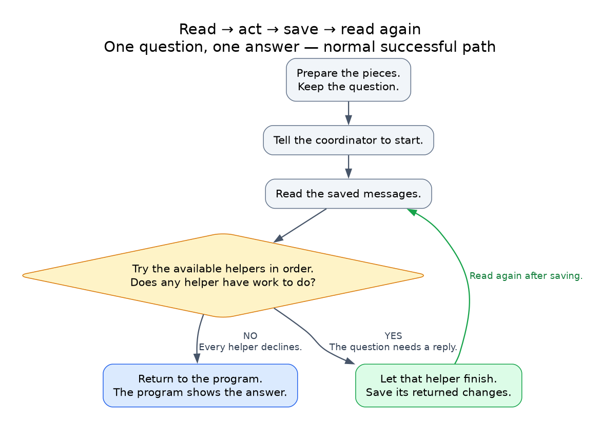
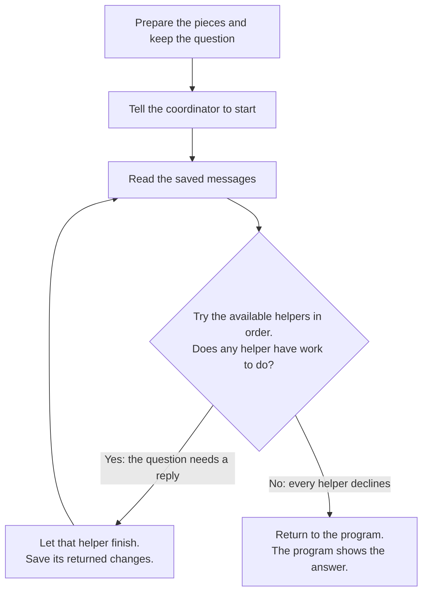

# Start here: one question, one answer

Forget the library names for now. The job is:

> Keep a question, get an answer, keep the answer, and show it.

For just this job, a direct call to the model would be simpler. The extra arrangement is useful when the program may need several different kinds of work, and the next action depends on what happened earlier. We do not need those extra kinds of work to understand this example.

## What we create, and why

These are objects inside one program, not separate people, servers, or background processes.

| What we create | Why we need it | What it will be used for |
|---|---|---|
| A place to keep messages | We need the question and answer to remain available while the program runs. | Keep the question first, then add the answer. This example uses memory, not a disk file. |
| A connection object for the model service | Something must know how to contact the model service. | Send the question and receive the answer. Creating this object does not send anything yet. |
| A helper that can ask the model | Something must decide whether a reply is needed and perform the request. | Read the messages; if a reply is needed, use the connection to ask for it and collect the response. |
| A coordinator with a list of available helpers | We want one place to manage “look, do something if needed, save, look again.” | Try the helpers in order. In this example, the list contains only the model-asking helper. |
| A temporary tray for text to display | This particular example keeps response pieces for the screen separate from the saved conversation. | Collect pieces while the model responds; print them after the coordinator finishes. This is an output choice, not what decides completion. |

Building these objects is preparation. The program then explicitly tells the coordinator to start.

## What happens after we start

1. The coordinator reads the saved messages. There is only the question.
2. It tries the model-asking helper.
3. That helper sees a message labeled “from the user,” with no model reply following it. For this simple successful case, its rule says a reply is needed.
4. The helper sends the question to the model service and waits for the response.
5. The helper collects the response pieces into an answer. It also puts display copies into the temporary tray.
6. It hands back the answer with an instruction to add it to the saved messages.
7. The coordinator has that instruction carried out. The saved messages now contain the question and answer.
8. The coordinator reads those saved messages again and starts at the beginning of its helper list.
9. The same helper now sees that the latest message is labeled “from the model.” Its rule says not to ask the model again.
10. There are no other helpers in the list. Nobody acted, so the coordinator returns control to the program.
11. The program prints the text from the tray. It also prints the saved messages as a separate diagnostic.

The coordinator is not checking every second. It checks again after a helper finishes and its changes have been saved. It waits while that helper is doing its work.

## The whole idea in one picture

[Scalable picture](plain-english-flow.svg)

The “yes” check and the work are shown separately to explain the idea. Some helpers decide and act within a single call; this is not a specification of separate method calls.

## What “finished” actually means

The coordinator does not judge the answer's quality or understand the user's goal. Its stopping rule is much narrower:

> I tried every helper on my list, and none of them did any work. This run is over.

There is no special “all done” value in the saved messages. The saved messages are evidence that each helper interprets using its own rules. The helper list is held by the coordinator, not inside the saved messages.

A message from the model that asks for a tool would be a different case. With a tool-executing helper registered, that helper could act next. Without such a helper, the coordinator could stop with an unanswered tool request. Stopping means no registered helper applies, not that every possible need has been fulfilled.

After it returns, the coordinator does not keep watching. The program would need to start it again after adding another question. This example exits instead, and its saved messages in memory disappear.

## Why this feels complicated

The example introduces the decision-and-repeat pattern, replaceable storage, model communication, streamed output, and Rust's sharing/type syntax together. For one question and one answer, much of this arrangement feels like overhead because it is overhead. It is not required simply to call a model. Its payoff comes when more than one kind of work can be selected from the saved messages.

The first teaching goal should be just:

> Read what has happened → let one helper act if needed → save what changed → read again → stop if nobody acts.

The implementation names can wait until this makes sense.

## Other software uses related ideas

- **Kubernetes controllers:** examine recorded/current conditions and make changes when needed, repeatedly. This is a close relative of deciding the next action from current data. Unlike our one run, these controllers keep watching. [Official explanation](https://kubernetes.io/docs/concepts/architecture/controller/).
- **AWS Step Functions:** coordinates work using state machines. Its workflows define transitions between named states, so it is not the same “try a list of helpers again” design. It demonstrates that automated coordination through states is a common approach. [Official explanation](https://docs.aws.amazon.com/step-functions/latest/dg/concepts-statemachines.html).

## Verification completed

The normal-path description was checked against the current spike and the exact pinned library source: [coordinator loop](https://docs.rs/crate/goose-agent/0.1.0-alpha.11/source/src/machine.rs), [model-asking helper](https://docs.rs/crate/goose-agent/0.1.0-alpha.11/source/src/inference.rs), and the spike's own saving/display code. This is a teaching picture of the normal successful path; it omits error, cancellation, and explicit handoff behavior. No executable code was changed and no new model request was made.
